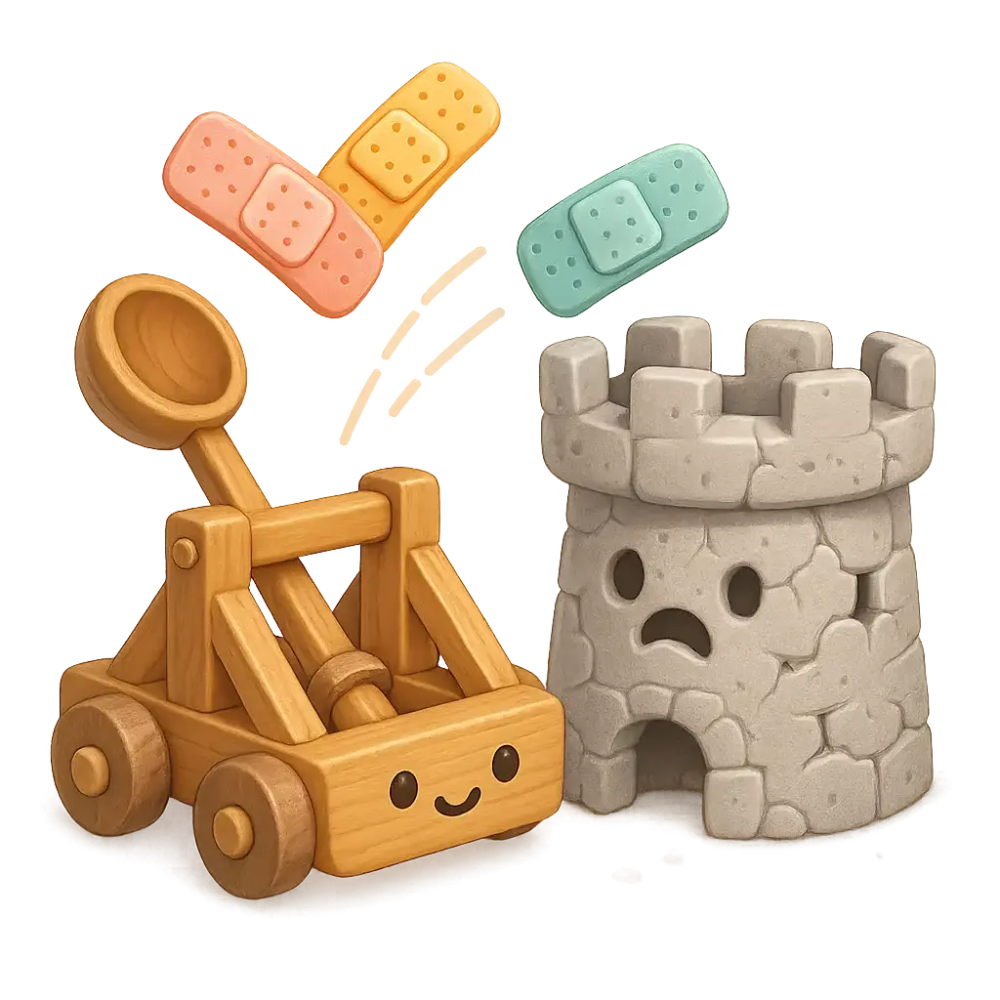

# AIMER: AI-Assisted Software Analysis & Improvement Prompts

AIMER provides battle-tested methodologies and structured approaches for software analysis and improvement, leveraging years of practical experience in software architecture and development. These aren't just prompts – they're distilled little frameworks based on solid foundations from industry expertise and proven practices.

Each command represents a specific analytical methodology designed to systematically examine different aspects of your software systems: from identifying architectural hotspots and documenting decisions to analyzing stakeholder needs and security concerns.

<div align="center">

</div>

## Use with Claude Code

You may use these prompts wherever you like. 
We’ll document a way to use them as [custom slash commands in Claude Code](https://docs.anthropic.com/en/docs/claude-code/tutorials#create-custom-slash-commands):

### Project-Specific Commands

To make AIMER prompts available within a specific project:

#### Option 1: Direct Clone

1. Clone this repository into your project's `.claude/commands` directory:

```bash
# Navigate to your project root
mkdir -p .claude/commands
git clone https://github.com/innoq/aimer.git .claude/commands
```

2. Use the commands in Claude Code with the `/project:` prefix:

```
claude > /project:hotspot-analysis
```

#### Option 2: Git Submodule (Recommended)
Adding AIMER as a Git submodule allows you to track specific versions and update more easily:

1. Add the repository as a submodule in your project:

```bash
# Navigate to your project root
mkdir -p .claude/commands
git submodule add https://github.com/innoq/aimer.git .claude/commands/aimer
```

2. Use the commands in Claude Code with the `/project:` prefix:

```
claude > /project:hotspot-analysis
```

3. Update the submodule when needed:

```bash
git submodule update --remote .claude/commands/aimer
```

### User-Specific Commands
To make AIMER prompts available for all your projects:

1. Clone this repository into your home Claude commands directory:

```bash
mkdir -p ~/.claude/commands
git clone https://github.com/innoq/aimer.git ~/.claude/commands
```

2. Use the commands in Claude Code with the `/user:` prefix:

```
claude > /user:hotspot-analysis
```

## Usage Tips
- Command names are derived from the filename (e.g., `hotspot-analysis.md` becomes `/project:hotspot-analysis`)
- You can organize prompts in subdirectories for better categorization
- Project-scoped commands are shared with team members who have access to the repository
- User-scoped commands are available to you across all projects
- All prompts use `$ARGUMENTS` to accept additional contextual information as parameter to `claude` on the CLI, as well as inside the REPL

### Using Thinking Mode (Reasoning)

All AIMER commands include a `$ARGUMENTS` placeholder that allows you to pass additional instructions to enhance Claude's analysis. One powerful use case is enabling **thinking mode** to get deeper, more thorough analysis. 

#### Examples

**Basic command:**
```
claude > /user:hotspot-analysis
```

**With thinking mode for deeper analysis:**
```
claude > /user:hotspot-analysis think
claude > /user:hotspot-analysis think harder
claude > /user:hotspot-analysis ultrathink
```

**Other useful argument patterns:**
```
claude > /user:code-walkthrough think and focus on error handling patterns
claude > /user:quality-scenario-analysis think and prioritize performance scenarios
claude > /user:stakeholder-interviews think especially about technical debt concerns
```

## Categories
- **Workflow Optimization**: Prompts for improving development workflows
- **Code and Architecture Analysis**: Deep-dive code analysis and improvement suggestions
- **Documentation**: Templates for generating and improving documentation

## Contributing
Contributions are welcome! Please feel free to submit a pull request with new prompts or improvements to existing ones.

## Maintainers
- Markus Harrer
- Roman Stranghöner
- Robert Glaser

## License
See the [LICENSE](LICENSE) file for details.

---

Made with ❤️ at [INNOQ](https://data-ai.innoq.com)


