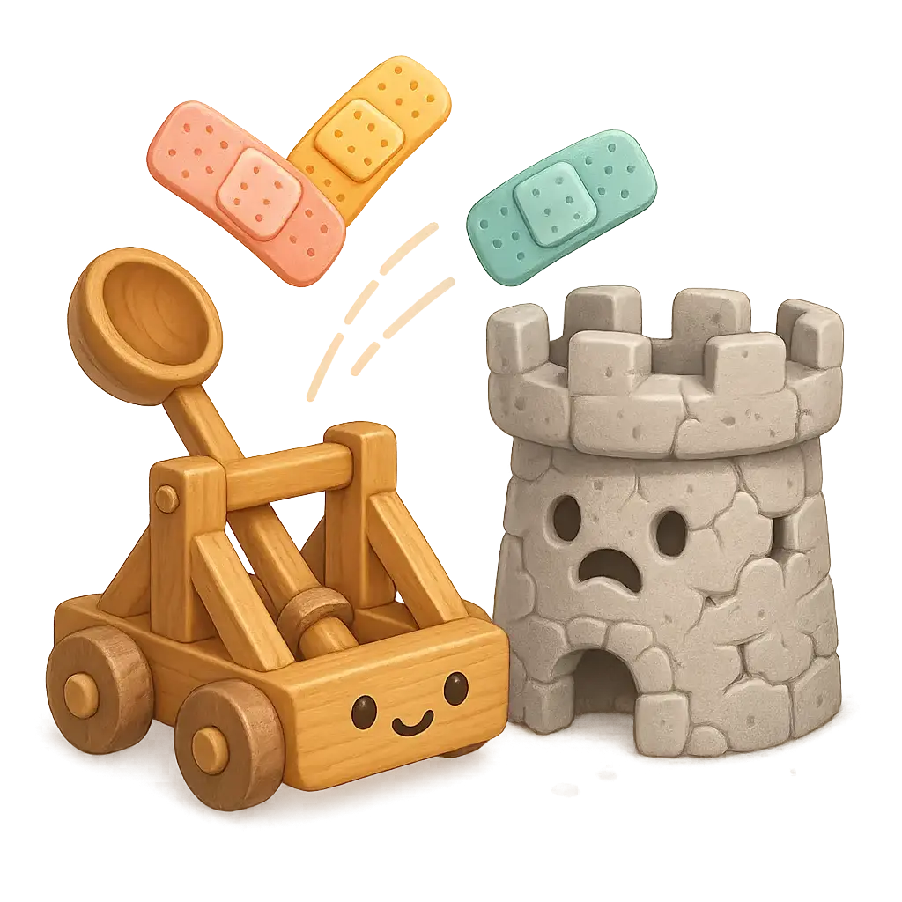

# AIMER: Experiments on AI-Assisted Software Analysis & Improvements

<div align="center">
    
</div>

## The Challenge

How can we make sense of and improve legacy systems using modern AI?

AIMER tackles this question by combining **Generative AI**, **agentic AI**, and **structured methodologies** for software analysis and improvement. We're inspired by proven approaches such as:

* The [**aim42 Architecture Improvement Method**](https://aim42.github.io/), which offers a structured way to analyze and evolve complex systems.
* The book [**Software Reviews**](https://leanpub.com/software-reviews-en), which provides practical, experience-driven techniques for understanding software quality and architecture.

Both aren't just abstract theories but contain battle-tested activities from real projects. Our goal is to translate them into actionable, reusable AI-powered workflows to make analyzing and improving software systems more efficient.

### What We Want to Achieve

We want to create a tool that supports developers and architects in analyzing and improving legacy systems by guiding Large Language Models (LLMs) through codebases, artifacts, and architecture.

For this, this repository contains early ideas and prototypes of commands for Claude Code that implement parts of the aim42 method and Software Reviews techniques. Most of them will not work yet and need improvement to get the best out of Large Language Models. Therefore, we want to explore agentic workflows, where LLMs act as autonomous agents performing complex analysis tasks by combining code, documentation, Git history, quality models, and more.

### But We Need Your Help!

Legacy systems are rarely clean. They’re huge, undocumented, and deeply embedded in real business processes. To generate valuable insights, LLMs need to:

* Navigate and interpret sprawling, inconsistent codebases
* Understand implicit decisions and trade-offs
* Connect technical structures to architectural and stakeholder concerns
* Make suggestions based on trustworthy data that can also be verified by humans
* Deliver actionable insights — ideally even suggesting or automating specific refactorings, and not vague advice

This is more than prompt engineering — it's about designing a mini framework that structures how an LLM thinks about software systems.

### How You Can Help

This is an open challenge and an evolving community effort.

We welcome contributions such as:

* Designing prompts or commands that operationalize analysis techniques
* Proposing how agents can autonomously explore and reason about legacy systems
* Sharing real-world cases that stress-test our prototypes
* Exploring hybrid integrations: static analysis + architecture views + LLM insights

We believe AI can become a true partner in software modernization — not by replacing human judgment, but by scaling and systematizing our expertise.


## The Vision of AIMER

*This is what we aim for with the AIMER project:*

AIMER provides battle-tested methodologies and structured approaches for software analysis and improvement, leveraging years of practical experience in software architecture and development. These aren't just prompts – they're distilled little frameworks based on solid foundations from industry expertise and proven practices.

Each command represents a specific analytical methodology designed to systematically examine different aspects of your software systems: from identifying architectural hotspots and documenting decisions to challenging security concerns and the original stakeholder needs and assumptions.


## Current Status 

We're working in public to explore what's currently possible with AI-assisted architecture development and legacy system modernization together with you!

For this, we've created several commands for Claude Code and are using a lightweight process, mapped to three directories:

* `ideas`: Early-stage prompts and concepts, many inspired by resources like the *aim42* guide or the book *Software Reviews*. Some suggestions may not make sense yet and possible to implement with today's technologies, but we'll refine and filter them over time. See the contents of this directory more like an initial brainstorming.

* `experiments`: More developed ideas and commands we're actively testing. They're absolutely not production-ready, but first developers are working on those to evolve them into something that could actually work. Here we especially welcome discussions and feedback to improve their robustness and usefulness.

* `prod`: Stable prompts that work reliably and help answer architectural questions, especially in real-world legacy modernization scenarios.

Depending on your goals, copy the commands you want to work on into Claude Code's `commands` directory or add new ideas directly to the repository with a Pull Request.


## Current Usage Scenarios

We're using Claude Code as starting point for our first experiments in this area to avoid creating something that will be obsolete with the next iteration of AI assistents.

You may use these prompts wherever you like.

We’ll document a way to use them as [custom slash commands in Claude Code](https://docs.anthropic.com/en/docs/claude-code/tutorials#create-custom-slash-commands):

### A. Use commands within a single project / repo (Recommended)

To make AIMER prompts available within a specific project or repository you have two options:

#### Option A.1: Git Submodule (Recommended)

Adding AIMER as a Git submodule allows you to track specific versions and update more easily:

##### A.1.1 Add the repository as a submodule in your project

Navigate to your project root and execute:
```bash
mkdir -p .claude/commands
git submodule add https://github.com/innoq/aimer.git .claude/commands/aimer
```

##### A.1.2 Update the submodule when needed

```bash
git submodule update --remote .claude/commands/aimer
```

#### Option A.2: Direct Clone

Create a simple clone of the current state of the AIMER repository

##### A.2.1. Clone this repository into your project's `.claude/commands` directory

```bash
# Navigate to your project root
mkdir -p .claude/commands
git clone https://github.com/innoq/aimer.git .claude/commands
```

#### Executing commands

You can execute the commands with a starting `/`. The AIMER commands will reflect the file names of the prompt templates.

Take a look at the suffix of the command's description to see in which stage the command is (e.g. `(project:ideas)`) before using it.

### B. Use commands User-wide

Instead making a copy / clone to a specific project dir, you can also put AIMER into your user's home directory:

```bash
mkdir -p ~/.claude/commands
git clone https://github.com/innoq/aimer.git ~/.claude/commands
```

#### Executing commands

You can execute the commands with a starting `/`. The user-wide AIMER commands will have the suffix `(user)` (as other existing user commands will, too). Unfortunately, you won't see in which state the current command is. Therefore, this usage variant isn't recommended currently.

## Usage Tips

**💡 Important Hint**: All AIMER prompts are designed for **thinking mode (reasoning)** or, if not using Claude, models that can do chain-of-thought reasoning. For optimal results, append terms like "think", "think harder", or "ultrathink" to your slash commands. By default, thinking mode is not activated, so remember to explicitly enable it for deeper, more thorough analysis.

- Command names are derived from the filename (e.g., `hotspot-analysis.md` becomes `/hotspot-analysis`)
- You can organize prompts in subdirectories for better categorization
- Project-scoped commands are shared with team members who have access to the repository
- User-scoped commands are available to you across all projects
- All prompts use `$ARGUMENTS` to accept additional contextual information as parameter to `claude` on the CLI, as well as inside the REPL


### Using Thinking Mode (Reasoning)

All AIMER commands include a `$ARGUMENTS` placeholder that allows you to pass additional instructions to enhance Claude's analysis. One powerful use case is enabling **thinking mode** to get deeper, more thorough analysis. 

#### Examples

**Basic command:**
```
claude > /hotspot-analysis
```

**With thinking mode for deeper analysis:**
```
claude > /hotspot-analysis think
claude > /hotspot-analysis think harder
claude > /hotspot-analysis ultrathink
```

**Other useful argument patterns:**
```
claude > /code-walkthrough think and focus on error handling patterns
claude > /quality-scenario-analysis think and prioritize performance scenarios
claude > /stakeholder-interviews think especially about technical debt concerns
```

## Categories
- **Workflow Optimization**: Prompts for improving development workflows
- **Code and Architecture Analysis**: Deep-dive code analysis and improvement suggestions
- **Documentation**: Templates for generating and improving documentation

## Contributing
Contributions are welcome! When creating or modifying prompts, please follow our [Prompt Guidelines](prompt-guideline.md) to ensure consistency and quality across all AIMER commands.

Please feel free to submit a pull request with new prompts or improvements to existing ones.

## Maintainers
- [Roman Stranghöner](https://www.innoq.com/en/staff/roman-stranghoener/)
- [Robert Glaser](https://www.innoq.com/en/staff/robert-glaser/)

## License
See the [LICENSE](LICENSE) file for details.

---

Built with ❤️ by humans and machines at [INNOQ](https://www.innoq.com).

<a href="https://www.innoq.com">
    
</a>
